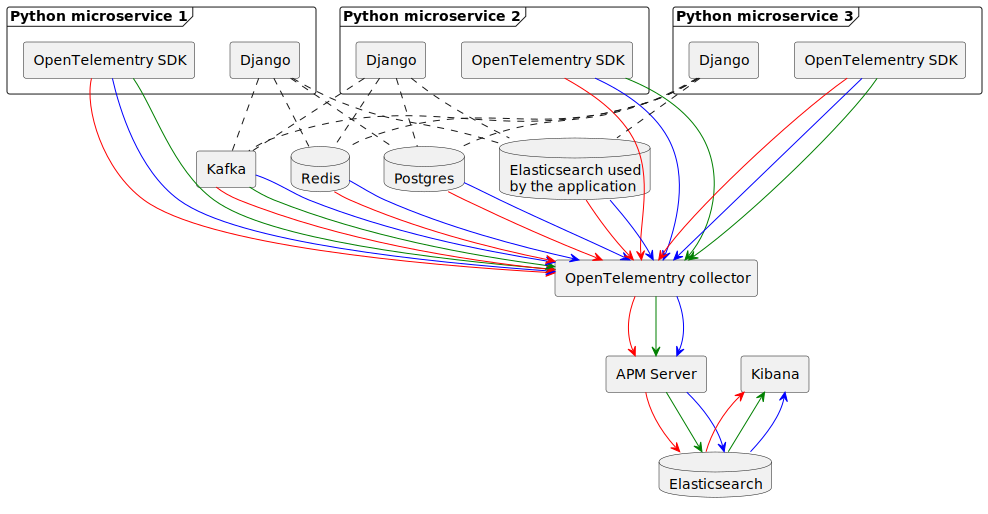
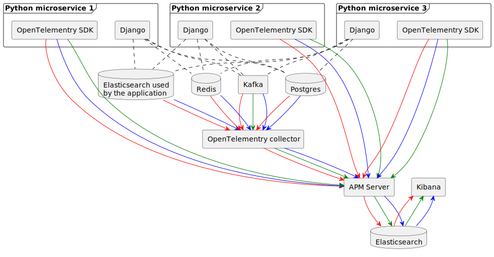
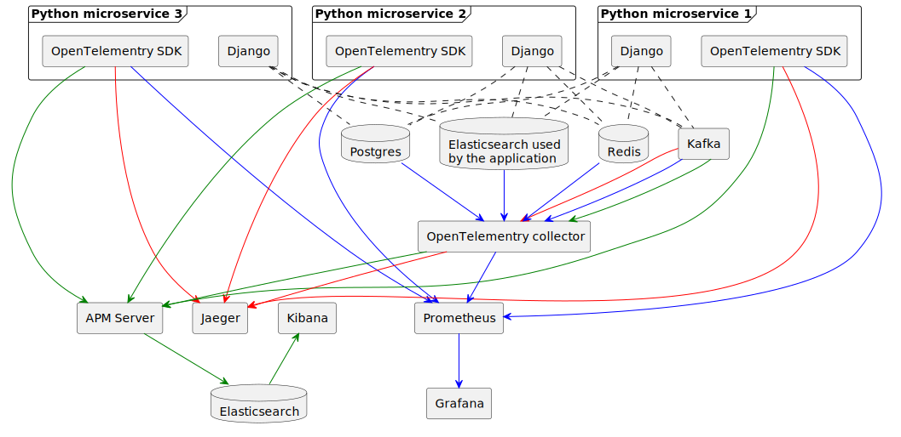
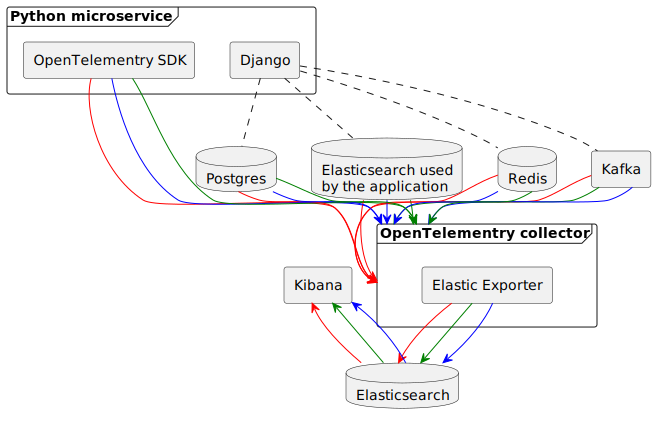

# Introduction

In the evolving landscape of microservice architecture, effective observability is crucial for maintaining the performance and reliability of distributed systems. As applications grow more complex, pinpointing the root cause of issues becomes increasingly challenging. This is where OpenTelemetry, a powerful, open-source observability framework, comes into play. OpenTelemetry provides a unified set of APIs and libraries to capture and export traces, metrics, and logs from your applications, enabling comprehensive monitoring and troubleshooting.

This report focuses on the instrumentation of the main components of DKP: our Python/Django services, Postgres, Elasticsearch and Redis.

## Django instrumentation

Opentelemetry provides a set of libraries (`opentelemetry-sdk`, `opentelemetry-instrumentation-django` and `opentelemetry-exporter-otlp-proto-grpc`) that
allow to generate traces and metrics and capture logs from an existing python application.

The instrumentation does not require extensive code changes and can be centralized in a single python module but explicit code may be required to generate additional spans or metrics that are not included in the provided library, specifically all application-specific metrics will require some engineering effort.

Logs can be pushed using a [special handler](https://github.com/mhausenblas/ref.otel.help/blob/main/how-to/logs-collection/yoda/main.py#L34) provided by the OpenTelemetry SDK that integrates with Python `logging` library.
Metrics, traces and logs can all be exported using the OTLP protocol and either sent directly to a compatible backend (like the APM server) or to a [centralized Opentelemetry collector](https://opentelemetry.io/docs/collector/deployment/gateway/).

## Postgres instrumentation

The [Opentelemetry Collector](https://github.com/open-telemetry/opentelemetry-collector-contrib/tree/main/receiver/postgresqlreceiver) has support
for extracting [Postgres metrics](https://github.com/open-telemetry/opentelemetry-collector-contrib/blob/main/receiver/postgresqlreceiver/metadata.yaml),
traces could be generated on the client side [instrumenting the database driver](https://github.com/open-telemetry/opentelemetry-python-contrib/tree/main/instrumentation/opentelemetry-instrumentation-psycopg2).

For the logs the only way seems to be to write them to a file and [run the Opentelementry collector on the same filesystem to collect them]
(https://github.com/open-telemetry/opentelemetry-collector-contrib/tree/main/receiver/filelogreceiver)

## Redis instrumentation

The [Opentelemetry Collector](https://github.com/open-telemetry/opentelemetry-collector-contrib/tree/main/receiver/redisreceiver) has support
for extracting [Redis metrics](https://github.com/open-telemetry/opentelemetry-collector-contrib/blob/main/receiver/redisreceiver/metric_functions.go),
traces could be generated on the client side [instrumenting the redis client](https://github.com/open-telemetry/opentelemetry-python-contrib/tree/main/instrumentation/opentelemetry-instrumentation-redis).

For the logs the only way seems to be to write them to a file and [run the Opentelementry collector on the same filesystem to collect them]
(https://github.com/open-telemetry/opentelemetry-collector-contrib/tree/main/receiver/filelogreceiver)

## Elasticsearch instrumentation

[The Opentelemetry Collector](https://github.com/open-telemetry/opentelemetry-collector-contrib/tree/main/receiver/elasticsearchreceiver) supports extracting metrics from a remote elasticsearch instance, traces could be generated on the client side [instrumenting the elasticsearch client](https://github.com/open-telemetry/opentelemetry-python-contrib/tree/main/instrumentation/opentelemetry-instrumentation-elasticsearch).

For the logs the only way seems to be to write them to a file and [run the Opentelementry collector on the same filesystem to collect them]
(https://github.com/open-telemetry/opentelemetry-collector-contrib/tree/main/receiver/filelogreceiver)

## Kafka instrumentation

[The Opentelemetry Collector](https://github.com/open-telemetry/opentelemetry-collector-contrib/tree/main/receiver/kafkareceiver) supports extracting traces,metrics and logs from a remote kafka instance.

Alternatively, it is possible to [use auto-instrumentation](https://opentelemetry.io/docs/demo/services/kafka/)
adding OpenTelemetry Java agent to the Kafka JVM process to extract metrics and push them to an OTLP-compatible endpoint,
logs can be written to a file and [run the Opentelementry collector on the same filesystem to collect them]
(https://github.com/open-telemetry/opentelemetry-collector-contrib/tree/main/receiver/filelogreceiver) and
traces could be generated on the client side [instrumenting the kafka client](https://github.com/open-telemetry/opentelemetry-python-contrib/tree/main/instrumentation/opentelemetry-instrumentation-kafka-python).

## APM server or Opentelemetry collector with elasticsearch exporter?

[Elasticsearch exporter](https://www.elastic.co/guide/en/apm/get-started/7.10/open-telemetry-elastic.html) inside
[Opentelemetry Collector](https://github.com/open-telemetry/opentelemetry-collector-contrib/tree/main/exporter/elasticsearchexporter) is [now considered deprecated](https://www.elastic.co/guide/en/apm/get-started/7.15/open-telemetry-elastic.html) and users are advised to send traces, logs and metrics to the APM server that now natively supports OTLP the protocol.

# Proposed architectures

In the following diagrams the color of the arrow represents the type of data being pushed:

- red for traces
- blue for metrics
- green for logs

### A) Push all to Opentelemetry Collector first, then export to the APM server

Pros

- centralized collection point that can be used to easily enrich, filter, process the data coming from all different components
- can scale horizontally using a reverse proxy
- easy to switch to a different telemetry backend (just need to reroute the exporters in the opentelementry collector)

Cons

- it still requires running the APM server, which only serves the purpose of receiving the data using OTLP protocol and ingest it into Elasticsearch
- the collector is (another) single point of failure for the whole telemetry system

### B) Export everything directly to APM server

Pros

- a failure of the Opentelemetry collector doesn't cause a failure of the whole telemetry system

Cons

- requires to use APM server to enrich, filter and process data, which makes it hard to migrate to a different backend
- still requires to run the Opentelemetry collector some subsystems (Kafka, Redis, Postgres and Elasticsearch) are difficult/impossible to instrument otherwise

### C) Use a specialized backend for each one of logs, metrics and traces

Pros

- more specialized tools (a tool that only handles traces may have more feature than a tool that tries to handle everything)

Cons

- hard to correlate logs, traces and metrics
- more complex (bigger attack surface, requires mainenance of different applications)

### D) Push all to Opentelemetry collector, then use the Elastic exporter to export the data to Elasticsearch

Pros

- less moving parts (no need to run the APM server)
- centralized collection point that can be used to easily enrich, filter, process the data coming from all different components
- can scale horizontally using a reverse proxy
- easy to switch to a different telemetry backend (just need to reroute the exporters in the opentelementry collector)

Cons

- no long term support (Elastic exporter is deprecated), it may require to migrate to solution A) at some point
